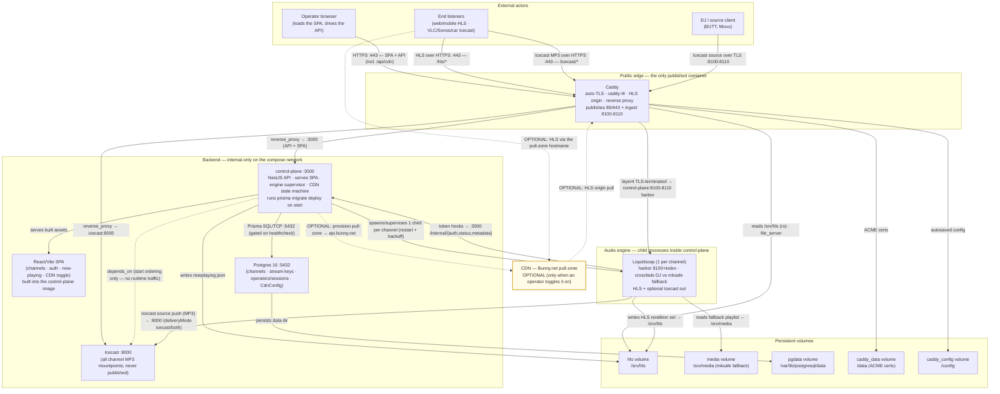

# Aerial — System Diagram (current state)

This diagram is the **current, implemented state** of Aerial on `main`: the containers that actually
run, the processes they spawn, and the real data/control paths between them. It deliberately excludes
planned and non-goal work (see [Intentionally not shown](#intentionally-not-shown-future--non-goals)).

> **⚠️ Keep this in sync.** Whenever a **system component or data path changes** — a new/removed service or
> volume in [`deploy/docker-compose.yml`](./deploy/docker-compose.yml), a new NestJS module under
> [`apps/control-plane/src/`](./apps/control-plane/src), a new edge route in
> [`deploy/caddy/Caddyfile`](./deploy/caddy/Caddyfile), or a new engine output — **update the diagram and the
> component table in this file in the same PR**, and the design topology in
> [`docs/ARCHITECTURE.md`](./docs/ARCHITECTURE.md) if it changes too. Keep optional paths (CDN) dashed and
> labelled OPTIONAL; never add future / non-goal items.

For the reasoning behind each component see [`docs/ADRS.md`](./docs/ADRS.md); for the design/target topology
(which may show fast-follow items) see [`docs/ARCHITECTURE.md`](./docs/ARCHITECTURE.md).

## Diagram

## Legend

- **Solid arrows** are always-on data/control paths in the running stack; **edge labels** carry the
  protocol/port and purpose.
- **Dashed arrows** are either start-ordering only (the `control-plane ⇢ icecast` `depends_on`, which is
  *not* runtime traffic) or **OPTIONAL** paths. The CDN (highlighted) is only in the data path once an
  operator pastes a Bunny.net API key and flips the toggle on; until then listeners are served straight from
  the Caddy HLS origin.
- **Groups:** *External actors* live outside the deployment; the **public edge** (Caddy) is the **only
  published container** (80/443 + DJ ingest 8100-8110); everything in *Backend*, *Engine* and *Volumes* is
  internal-only on the Docker Compose network.
- **Per-channel fan-out:** the single `Liquidsoap (1 per channel)` node represents *N* identical child
  processes — control-plane spawns one per channel, each binding harbor port `HARBOR_BASE_PORT (8100) +
  channel index`, so the published ingest range `8100-8110` maps one TLS port per channel through Caddy's
  layer4 module to the matching harbor.
- **Now-playing:** Liquidsoap pushes track/live metadata to control-plane's `/internal` hooks; control-plane
  writes a cacheable `nowplaying.json` into the `hls` volume, which Caddy serves alongside the segments.

## Components

| Component | Type | Responsibility | Source |
|---|---|---|---|
| Operator browser | External actor | Loads the SPA and drives the control-plane API over HTTPS (channel CRUD, auth/session, now-playing, the one-toggle CDN controls). | *(external)* — consumes [`apps/web/`](./apps/web) |
| DJ / source client (BUTT, Mixxx) | External actor | Pushes a live Icecast source stream over TLS to a per-channel ingest port (8100-8110); stream key checked via the `/internal` hook. | *(external)* — auth at [`apps/control-plane/src/internal/`](./apps/control-plane/src/internal) |
| End listeners | External actor | Consume HLS playlists/segments (`/hls/*`) or origin-direct Icecast MP3 mounts (`/icecast/*`) over HTTPS. | *(external)* |
| Caddy | Public edge | Only published container: auto-TLS, `file_server`s HLS as a cacheable origin, reverse-proxies SPA/API and Icecast, and layer4-TLS-terminates DJ ingest. Publishes 80/443 + 8100-8110. | [`deploy/caddy/Caddyfile`](./deploy/caddy/Caddyfile), [`deploy/caddy/Dockerfile`](./deploy/caddy/Dockerfile) |
| control-plane | Service (backend) | NestJS API + SPA host on :3000; runs `prisma migrate deploy` on start; supervises one Liquidsoap child per channel with restart/backoff; hosts the one-toggle CDN state machine. Image bundles Node + Liquidsoap + ffmpeg. | [`apps/control-plane/src/`](./apps/control-plane/src) (`main.ts`, `app.module.ts`, `engine/`, `cdn/`) |
| React/Vite SPA | Frontend | Operator UI for channels, auth, now-playing and the CDN toggle; built and baked into the control-plane image (served on `:3000`). | [`apps/web/src/`](./apps/web/src) (`App.tsx`, `api.ts`, `auth-client.ts`) |
| Liquidsoap (1 per channel) | Child process (engine) | Per-channel engine spawned inside control-plane: binds harbor `8100+index`, crossfades live DJ vs the `mksafe` fallback, writes the HLS rendition set to `/srv/hls`, optionally pushes an Icecast MP3 source, and calls the `/internal` hooks. | [`apps/control-plane/src/engine/`](./apps/control-plane/src/engine) (`liq-template.ts`, `engine.service.ts`) |
| Icecast | Service (engine) | Hosts all channel MP3 mountpoints (created when Liquidsoap connects as source); `expose 8000` only, reachable solely via Caddy `/icecast/*`. | [`engine/icecast/`](./engine/icecast) |
| Postgres 16 | Datastore | Stores channels, stream keys, operators/sessions and the singleton `CdnConfig` row; internal-only `:5432`; `pg_isready` healthcheck gates control-plane start. | [`apps/control-plane/prisma/schema.prisma`](./apps/control-plane/prisma/schema.prisma), [`deploy/docker-compose.yml`](./deploy/docker-compose.yml) |
| hls volume | Volume | Shared HLS output: written by Liquidsoap (and `nowplaying.json` by control-plane) at `/srv/hls`, mounted read-only into Caddy as the origin. | [`deploy/docker-compose.yml`](./deploy/docker-compose.yml) |
| media volume | Volume | Per-channel fallback media at `/srv/media`, played by Liquidsoap as the `mksafe` fallback (silence if empty). | [`deploy/docker-compose.yml`](./deploy/docker-compose.yml) |
| pgdata volume | Volume | Persists the Postgres data directory (`/var/lib/postgresql/data`). | [`deploy/docker-compose.yml`](./deploy/docker-compose.yml) |
| caddy_data / caddy_config volumes | Volume | Persist Caddy's ACME certs/account (`/data`) and autosaved runtime config (`/config`). | [`deploy/docker-compose.yml`](./deploy/docker-compose.yml) |
| CDN (Bunny.net pull-zone) | Optional external | Conditional HLS front for the Caddy origin; provisioned by control-plane via `api.bunny.net` **only when an operator enables the toggle**. Bunny is the only adapter today. | [`apps/control-plane/src/cdn/`](./apps/control-plane/src/cdn) (`cdn.service.ts`, `bunny.provider.ts`) |

## Intentionally not shown (future / non-goals)

To keep this a faithful current-state view, the following are **deliberately omitted** because they do not run
on `main` today (per SPEC §3 non-goals and `docs/ADRS.md`):

- **Auto-DJ / media library + upload** — fast-follow; the `media` volume exists but only as the `mksafe`
  fallback source, not a populated library.
- **Scheduling / clockwheels** — deferred; there is no scheduler/cron component (`@nestjs/schedule` is not
  wired in).
- **Nightly off-VM Postgres backup (S3-compatible)** — described in ADR D11 but not yet implemented in code.
- **Kubernetes / K3s / KEDA, and any relay fleet (pods or ECS tasks)** — hard non-goals; the stack is plain
  Docker Compose and scales via CDN-over-HLS, not relays.
- **AWS-native / SST / Fargate / CloudFront deployment** — rejected deployment model.
- **Branded/full listen page and embeddable player** — v1 exposes endpoints + metadata only (bring-your-own
  frontend).
- **In-browser "Go Live" / WebRTC ingest** — future; v1 ingest is desktop source software via the harbor.
- **Extra CDN provider adapters (Gcore / CDN77 / Cloudflare)** — backlog; only the Bunny adapter exists.
- **Social/SSO login (Google/GitHub)** — env-gated off in v1.
- **Multi-tenant SaaS / hosted tier** — out of scope; single-operator only.
