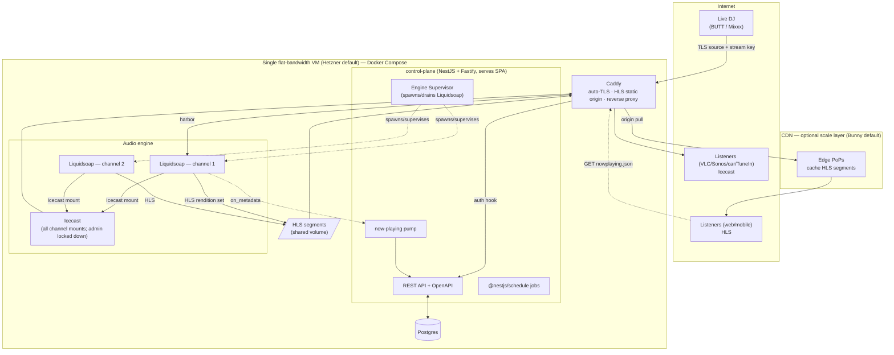

# Aerial — System Architecture

Aerial is a **CDN-native, self-hosted online radio platform**. The design principle is one sentence:

> **Self-host the lightweight brain; rent the bandwidth-bound edge over cacheable HLS — and only when the
> audience justifies it.**

See [`ADRS.md`](./ADRS.md) for the decisions behind every component, and
[`legacy/`](./legacy) for the superseded K3s and AWS/SST designs.

## Topology



## Components

| Component | Role |
|-----------|------|
| **Caddy** | Single public entrypoint (custom image with the `caddy-l4` plugin). Automatic Let's Encrypt TLS; reverse-proxies the control plane; serves the HLS segment directory as the CDN origin; proxies the Icecast mounts; and **terminates DJ-ingest TLS at layer 4** (ports 8100–8110), proxying the decrypted source to the internal harbor. |
| **control-plane (NestJS/Fastify)** | The brain. Channel CRUD, operator auth, stream-key issuance/verification, per-channel Liquidsoap **config-gen + spawn/supervise**, the now-playing pump, CDN auto-provisioning (fast-follow), analytics + cost projection. Serves the built SPA. Exposes an OpenAPI-documented public API. |
| **Engine Supervisor** | A control-plane module that generates each channel's `.liq` config and manages one Liquidsoap **child process per channel** with lifecycle hooks (start on boot, graceful drain on shutdown, restart on crash). |
| **Liquidsoap (×N channels)** | Per channel: a `fallback([live, loop])` pipeline (instant cutover via `track_sensitive=false`, `mksafe` loop) emitting **two outputs** — an HLS rendition set + one Icecast mount. |
| **Icecast** | Hosts all channel mountpoints for low-latency/legacy/directory listening. Admin/source locked down behind the TLS terminator; never CDN-fronted. |
| **Postgres** | State: users, stations/channels, stream keys (hashed), stream logs, analytics. Nightly off-VM backup. |
| **SPA (React/Vite/TS)** | The opinionated operator control panel. Static assets served by the control-plane container. |
| **CDN (Bunny, optional)** | The scale layer. Caches HLS segments at the edge so origin load stays ~constant under viral spikes. Auto-provisioned from the control plane (fast-follow). |

## Two delivery paths (and the hard rule)

| | **HLS** (default, scale + web/mobile) | **Icecast** (origin-direct) |
|---|---|---|
| Transport | Immutable AAC segments + rolling `.m3u8` | Persistent HTTP stream |
| Codec | HE-AAC 64k + AAC-LC 128k (adaptive) | MP3 128k (broad compatibility) |
| Latency | ~16–24s | ~2–8s |
| Scale | **CDN-cacheable → near-unlimited**, origin ~constant | Bandwidth-bound at origin/relay |
| Best for | Browsers, iOS/Android, embedding | VLC, Sonos, car head units, TuneIn, interactive |
| Metadata | `nowplaying.json` (cacheable, short TTL) | inline ICY `StreamTitle` |

> **Hard rule:** the CDN only ever serves HLS objects. The Icecast stream is **never** CDN-fronted (it is
> uncacheable; doing so collapses the scaling model). See [ADR D2](./ADRS.md#d2--delivery-hls-first--cdn-with-a-parallel-origin-direct-icecast-mount).

## Key flows

**Ingest + auth.** DJ points BUTT/Mixxx at the channel's TLS ingest URL (`host:8100+index`, TLS on) with
`source` + the channel stream key → **Caddy terminates the TLS at layer 4** and proxies the decrypted
Icecast source to the channel's internal Liquidsoap harbor → harbor `auth` hook calls the control plane
`POST /internal/auth` → bcrypt + constant-time compare against the active hashed key → accept (200) or drop
(401). On accept, `fallback` crossfades from the loop to the live source; on disconnect it rolls back to the
loop. (A plaintext connection to the public ingest port is dropped by Caddy.)

**Delivery.** Liquidsoap writes HLS segments to the shared volume (served by Caddy → optionally pulled by the
CDN) and pushes one Icecast mount (served origin-direct). Operators consume the `.m3u8`, the Icecast URL, and
`nowplaying.json` from their own sites.

**Now-playing.** Liquidsoap `on_metadata` → control-plane endpoint → cache + write `nowplaying.json` (short
TTL); Icecast listeners get inline ICY for free.

## Scaling path (bytes, not pods)

1. **Vertical NIC headroom** — move to a 2.5/10 Gbit box.
2. **CDN-over-HLS** — flip the in-app toggle; the edge absorbs the audience.
3. **Self-run Icecast relay nodes** — separate VMs for the legacy/directory path, if needed.
4. **Warm-standby origin** — HA for the ingest+packaging SPOF (scale/harden phase).

## Repo layout

```
aerial/
  apps/
    control-plane/      # NestJS (Fastify adapter): API + engine-supervisor module; serves built SPA
    web/                # React + Vite + TS SPA (shadcn/Radix + Tailwind)
  packages/shared/      # shared TS types, zod schemas, generated API client/SDK
  engine/
    liquidsoap/         # templated .liq config-gen + Dockerfile (HLS + Icecast outputs, fallback/harbor)
    icecast/            # icecast config template + Dockerfile (all channel mounts; admin locked down)
  deploy/
    docker-compose.yml  # control-plane(+SPA) · icecast · postgres · caddy
    install.sh          # curl | bash one-command installer
    caddy/              # auto-TLS reverse proxy + HLS static origin
  docs/                 # ADRS.md · ARCHITECTURE.md · legacy/
  README.md
```
