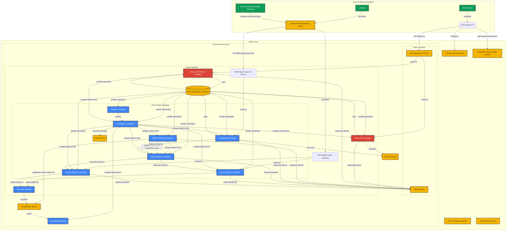

```mermaid
graph TD
    subgraph "Users & External Systems"
        A["Admin User"] -- accesses --> AdminUI("Next.js Admin UI")
        L["Listener"] -- accesses --> NLB_STREAM
        DJ["Live DJ w/ Broadcasting Software"] -- "connects via secured port" --> NLB_STREAM
    end

    subgraph "AWS Cloud"
        direction TB

        subgraph VPC ["Virtual Private Cloud"]
            direction LR

            subgraph "Public Subnets"
                NLB_API["API Gateway HTTP API"]
                NLB_STREAM["Network Load Balancer (NLB)"]
                NATGW["NAT Gateway"]
            end

            subgraph "Private Subnets"
                LB_Listener_TG("NLB Target Group: Listeners")
                LB_DJ_TG("NLB Target Group: DJ Source")

                subgraph ECS_Cluster ["ECS Cluster (Fargate)"]
                    direction TB
                    LS["Liquidsoap Container"]
                    IM["Icecast Master Container"]
                    IR1["Icecast Relay 1 Container"]
                    IRN["Icecast Relay N Container"]
                    MS["Metrics Scraper Container"]
                    PR["Prometheus Container"] -- "persistent storage" --> EFS("Amazon EFS")
                    GF["Grafana Container"]
                end

                DB[("RDS PostgreSQL Database")]
                LFN["Public API Lambdas"]
                NJS_API["Next.js API Routes Lambdas"]

                IR1 -- "scales based on" --> ECSAS["ECS Auto Scaling"]
                IRN -- "scales based on" --> ECSAS

                LFN -- "outbound internet" --> NATGW
                NJS_API -- "outbound internet" --> NATGW
                MS -- "outbound internet" --> NATGW
                LS -- "outbound internet" --> NATGW
                IM -- "outbound internet" --> NATGW
                IR1 -- "outbound internet" --> NATGW
                IRN -- "outbound internet" --> NATGW
            end

            NLB_STREAM -- "port 8000" --> LB_Listener_TG
            NLB_STREAM -- "port 8001 (secured by SG)" --> LB_DJ_TG

            LB_Listener_TG -- "routes to" --> IR1
            LB_Listener_TG -- "routes to" --> IRN
            LB_DJ_TG -- "routes to" --> LS

            DB -- "private connection" --> LFN
            DB -- "private connection" --> NJS_API
            DB -- "private connection" --> LS
            DB -- "private connection" --> IM
            DB -- "private connection" --> IR1
            DB -- "private connection" --> IRN
            DB -- "private connection" --> MS
            DB -- "private connection" --> PR
            DB -- "private connection" --> GF

            LFN -- accesses --> S3("S3 Audio Bucket")
            LS -- accesses --> S3

            NJS_API -- uses --> DB
            LFN -- uses --> DB
            LS -- uses --> DB

            MS -- "scrapes metrics from" --> IM
            MS -- "publishes custom metrics to" --> CW_M["CloudWatch Metrics"]
            MS -- "scrapes metrics for Prometheus from" --> IM

            ECSAS -- monitors --> CW_M

            PR -- "scrapes metrics from" --> LS
            PR -- "scrapes metrics from" --> IM
            PR -- "scrapes metrics from" --> IR1
            PR -- "scrapes metrics from" --> IRN
            PR -- "scrapes metrics from" --> MS
            PR -- "scrapes metrics from" --> NJS_API
            PR -- "scrapes metrics from" --> LFN
            PR -- "scrapes metrics from" --> CloudWatch_Exporter("CloudWatch Exporter")
            CW_M -- "fed to" --> CloudWatch_Exporter

            GF -- queries --> PR
        end

        CloudF["CloudFront Distribution"]
        S3_Static["S3 Bucket: Next.js Static Assets"]
        ECR["ECR: Container Registry"]
        IAM["IAM Roles & Policies"]
    end

    AdminUI -- "static assets served from" --> S3_Static
    AdminUI -- "fronted by" --> CloudF
    AdminUI -- "API calls go to" --> NLB_API

    NLB_API -- "routes to" --> NJS_API
    NLB_API -- "routes to" --> LFN

    LS -- "outputs stream to" --> IM
    IM -- "forwards stream to" --> IR1
    IM -- "forwards stream to" --> IRN


    %% Styling
    classDef awsService fill:#f4b400,stroke:#333,stroke-width:2px;
    class NLB_API,NLB_STREAM,NATGW,DB,S3,CW_M,ECR,EFS,CloudF,S3_Static,IAM awsService

    classDef k8sComponent fill:#4285f4,stroke:#333,stroke-width:2px,color:#fff;
    class LS,IM,IR1,IRN,MS,PR,GF,ECSAS,CloudWatch_Exporter k8sComponent

    classDef lambda fill:#db4437,stroke:#333,stroke-width:2px,color:#fff;
    class LFN,NJS_API lambda

    classDef user fill:#0f9d58,stroke:#333,stroke-width:2px,color:#fff;
    class A,L,DJ user

    class AdminUI fill:#FF8C00,stroke:#333,stroke-width:2px;
```