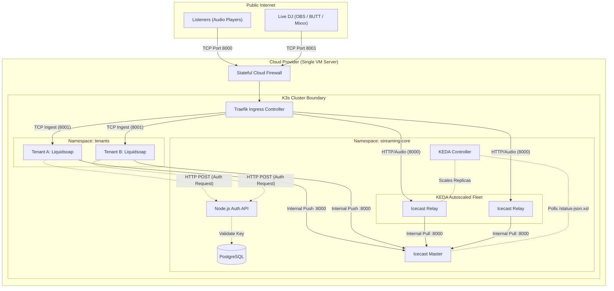

# Technical Specification: Containerized Radio Streaming Engine (v1.0)

## 1. Introduction & Project Context

### 1.1. Project Description
This project is a self-hosted, cloud-agnostic, multi-tenant online radio streaming platform. The platform allows multiple independent stations (tenants) to run isolated audio processing engines while sharing a centralized, highly scalable distribution network for public listeners.

### 1.2. Architectural Philosophy
The core architecture shifts away from traditional cloud-native serverless models (e.g., AWS Lambda, API Gateway, EventBridge) in favor of a unified, self-contained deployment footprint. The entire stack is orchestrated using **K3s (a lightweight Kubernetes distribution)** running on a **single cloud Virtual Machine (VM)**.

This approach delivers several distinct advantages:
* **Absolute Cost Efficiency:** Eliminates the premium costs of serverless execution, managed load balancers, and cloud NAT gateways. The entire platform runs at the baseline cost of the raw VM hardware.
* **Ultra-Low Internal Latency:** By placing the audio engines, authentication APIs, and distribution nodes within the same local cluster network, internal communication occurs in sub-milliseconds without crossing public internet boundaries.
* **Dynamic Resource Pooling:** Hardware capacity (CPU and RAM) is dynamically allocated across tenants and components based on real-time demand, maximizing infrastructure utilization.
* **Simplified Portability:** Because the entire system boundary is encapsulated by the K3s cluster, the platform can be dropped onto an empty Linux VM provided by any cloud vendor (Hetzner, DigitalOcean, Linode) or on-premises server.

### 1.3. Scope of Version 1.0
To establish a stable and performant core foundation, the initial release strictly focuses on the live streaming pipeline and access security:
* **In-Scope:** Isolated tenant live stream ingest (harbor), automated stream-key authentication via a lightweight internal API, local data persistence, and automatic scaling of listener capacity.
* **Explicitly Out-of-Scope:** Administrative user interfaces, advanced station scheduling/automation, and automated media library management. All audio sources default to either a live DJ broadcast or a continuous local fallback loop.

---

## 2. System Architecture

The following diagram illustrates the system boundaries, network ingress points, and internal workload topologies within the K3s cluster.



---

## 3. Infrastructure & Network Topology

The system maps external traffic patterns straight to the container ingress controller via a single public network interface.

### 3.1. Cloud Firewall Configuration
The hosting VM must be bound to a stateful firewall enforcing strict port access rules:
* **Port 8000 (TCP) [Public]:** Open to all incoming connections. Handles standard HTTP audio delivery to public streaming consumers.
* **Port 8001 (TCP) [Public]:** Open to all incoming connections. Handles raw Icecast/Shoutcast source connections from remote live broadcasting software.
* **Ports 80 / 443 (TCP) [Public]:** Open to all incoming connections. Reserved for standard web traffic and future expansion.
* **Port 22 (TCP) [Restricted]:** Restricted entirely to explicit administrator IP addresses for secure SSH access to the host machine.

### 3.2. Ingress Traffic Routing (Traefik)
K3s deploys Traefik out of the box as the primary entry point. It maps incoming TCP and HTTP packets directly to internal Kubernetes Services:
* Traffic hitting **Port 8000** is automatically balanced across the active pool of public **Icecast Relay** pods.
* Traffic hitting **Port 8001** parses the source path (e.g., `/tenant-a-live`) and maps the connection explicitly to the matching tenant's **Liquidsoap** pod.

### 3.3. Internal Cluster Communication
All background communication is completely isolated from the internet using Kubernetes `ClusterIP` services. Internal components resolve addresses via native CoreDNS (e.g., `http://auth-api.streaming-core.svc.cluster.local:3000`).

---

## 4. Component Deep Dive

### 4.1. Node.js Authentication API
A streamlined, lightweight runtime responsible for protecting ingest mountpoints.
* **Runtime Stack:** Node.js, Express.js, TypeScript (optional).
* **Database Target:** PostgreSQL (deployed as an internal cluster StatefulSet or as a minimal managed database instance).
* **Minimal Relational Schema:**
  * `stations`: `id` (UUID, PK), `name` (String), `mountpoint_slug` (String, Unique).
  * `stream_keys`: `id` (UUID, PK), `station_id` (UUID, FK), `key_value` (String, Hashed/Plaintext), `is_active` (Boolean).
* **Functional Logic:**
  1. Liquidsoap fires a synchronous `POST` hook to `/api/internal/auth` when a DJ attempts a connection.
  2. The request body contains the `mountpoint` along with the string passed into the connection's `password` field (the Stream Key).
  3. The API checks the database to verify if the key matches an active record for that specific station slug.
  4. Returns an `HTTP 200 OK` response to accept the live feed, or an `HTTP 401 Unauthorized` response to instantly drop the source TCP connection.

### 4.2. Liquidsoap Audio Engine (Per-Tenant Deployment)
Each tenant receives a completely isolated Liquidsoap deployment running in the `tenants` namespace. This structural division ensures strict fault isolation—a configuration error or panic in one tenant's audio engine cannot degrade adjacent stations.
* **Harbor Configuration:** Spun up to listen on Port 8001 on the assigned tenant path slug (e.g., `input.harbor("/tenant-a-live", port=8001)`).
* **Authentication Integration:** Outfitted with the native `auth` parameter pointed to the internal Node.js API endpoint.
* **Audio Pipeline Logic:** Implements the `fallback()` pattern with strict sensitivity settings. 
  * A continuous local source (such as a directory of standard placeholder tracks or a long branding file) loops indefinitely as the baseline.
  * The moment a DJ successfully logs into the harbor input, Liquidsoap gracefully crossfades from the local loop to the live input.
  * When the DJ drops the connection, the operator immediately rolls back to the local audio loop.
* **Stream Delivery:** Encodes the processing output and pushes it forward as a source connection to the internal Icecast Master instance.

### 4.3. Icecast Master
A dedicated instance isolated inside the `streaming-core` namespace.
* **Role:** Acts as the canonical source-of-truth junction box for the entire system. It receives input streams directly from all live tenant Liquidsoap engines.
* **Security Profile:** This component is completely locked down and is inaccessible to public listeners. It serves only to feed data down to the public relay layer.

### 4.4. Icecast Relays
The public-facing scale layer of the platform.
* **Role:** Relays handle the heavy lifting of audio distribution. Each relay connects internally to the Icecast Master, mirrors the active stream paths, and distributes clones of those audio packets out to thousands of public connections arriving via Traefik.
* **State Management:** Relays remain strictly stateless and can be spun up or terminated instantly without disrupting the upstream master configuration.

---

## 5. Scaling Mechanics (KEDA Implementation)

To safely absorb large traffic spikes on a single server without wasting idle capacity, the platform implements **KEDA (Kubernetes Event-driven Autoscaling)**.

* **Monitoring Strategy:** The KEDA Controller uses a standard `metrics-api` scaler to query the internal Icecast Master's live XML statistics (`http://icecast-master:8000/status-json.xsl`) every 15 seconds.
* **Metric Targeting:** The controller parses the resulting JSON payload to monitor the total concurrent listener metric (`icestats.listeners`).
* **Scale Target Boundaries:** * **Scale Increment:** For every 500 active listeners detected globally across the platform, KEDA commands the cluster to spin up 1 additional Icecast Relay pod.
  * **Floor Limit:** The minimum replica boundary is strictly set to `1`. The cluster will never scale the relay fleet down to zero, ensuring initial listeners always connect with zero delay.
  * **Ceiling Limit:** Bound explicitly to the physical limits of the hosting VM (e.g., restricting max replicas to 8 pods to safeguard server RAM limits).

---

## 6. Project Directory Blueprint

The project must be structured as a clean monorepo separating infrastructure manifests from core service code:

```text
online-radio-platform/
├── k8s/                           # All Kubernetes Orchestration Blueprints
│   ├── base/                      # Core Cluster Setup
│   │   ├── namespaces.yaml        # Defines 'streaming-core' and 'tenants'
│   │   ├── traefik-routing.yaml   # IngressRoute TCP/HTTP configuration
│   │   ├── database-set.yaml      # Postgres StatefulSet definition
│   │   └── keda-autoscaler.yaml   # KEDA ScaledObject rule sets
│   ├── workloads/                 # Primary Platform Workloads
│   │   ├── auth-api.yaml          # Node.js deployment & service manifests
│   │   ├── icecast-master.yaml    # Master Icecast deployment manifests
│   │   └── icecast-relays.yaml    # Public Relay deployment manifests
│   └── tenants/                   # Tenant Provisioning Blueprints
│       ├── tenant-a-engine.yaml   # Tenant A Liquidsoap deployment configuration
│       └── tenant-b-engine.yaml   # Tenant B Liquidsoap deployment configuration
├── src/                           # Application Runtimes
│   ├── api/                       # Minimal Auth API Source Space
│   │   ├── Dockerfile
│   │   ├── package.json
│   │   └── server.ts              # Express initialization and database logic
│   └── streaming/                 # Audio Processing Space
│       ├── liquidsoap/
│       │   ├── Dockerfile
│       │   └── engine.liq         # Central fallback & live harbor script logic
│       └── icecast/
│           ├── Dockerfile
│           ├── master.xml         # Protected master mounting configurations
│           └── relay.xml          # Client public routing configurations
└── README.md
```
